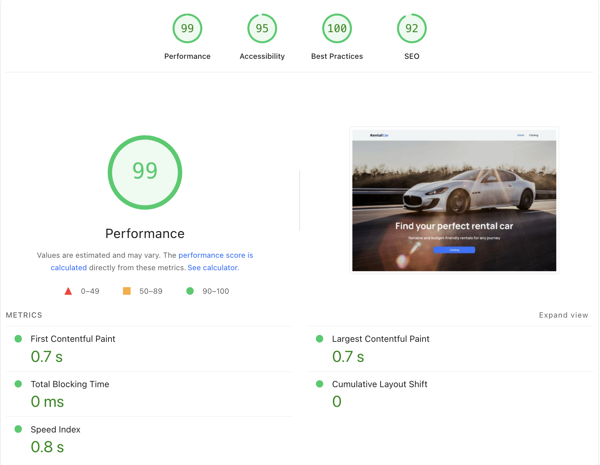

<p align="center">

</p>

## 🚗 Rental Car

**Rental Car** is a responsive web application for browsing and booking rental vehicles. It includes a smart filtering system, detailed car pages, booking form, and a favorites feature.

[🎨 View the Figma design](https://www.figma.com/design/A25LdVK3gZOPJaedrkTwWQ/Rental-Car?node-id=1-1196&t=NcwARngPxOMhMNru-0)

---

## 📚 Description

The application provides a user-friendly interface with the following functionality:

- Navigation through pages: Home and Catalog.
- Filtering cars by brand, rental price (up to a certain value), and mileage range.
- Viewing detailed information about each car.
- Adding cars to favorites (stored in Redux Persist — persists on page reload).
- A booking form with name, email, date picker (via React Datepicker), and comment.
- Upon submission, form data is logged in the console and a toast success message appears.

The UI is fully responsive with custom media query breakpoints for tablets and mobile devices.

---

## ⚙️ Technologies Used

- **React 19**
- **React Router DOM**
- **Redux Toolkit & Redux Persist**
- **Styled Components**
- **Axios**
- **React Select**
- **React Hook Form + Yup**
- **React Datepicker**
- **React Toastify**
- **React Lazy Load Image Component**
- **React Spinners**
- **Vite**

---

## 🚀 Getting Started

1. **Clone the repository**:

   ```bash
   git clone https://github.com/your-username/rentalcar.git
   cd rentalcar
   ```

2. **Install dependencies**:
   ```bash
   npm install
   ```
3. **Run the development server**:
   ```bash
   npm run dev
   ```
4. **Open in browser**:
   ```arduino
   http://localhost:5173
   ```
   The port may differ — check the terminal output.

---

## 🌐 API

The project uses a public API for rental car data:
[🔗 car-rental-api.goit.global (Swagger docs)](https://car-rental-api.goit.global/api-docs/)

---

## 📱 Responsive Design

Media query breakpoints:

```css
/* Mobile */
@media screen and (min-width: 320px) and (max-width: 480px);
```

```css
/* Tablet */
@media screen and (min-width: 481px) and (max-width: 1128px);
```

The app is fully optimized for mobile and tablet devices.

---

## 🧭 Routing

- "/" – Home page with a call-to-action button.

- "/catalog" – Catalog page with filtering and car listing.

- "/catalog/:id" – Detailed car view.

- "" – 404 Not Found page.

---

## 🗂 Project Structure

- components/ – Reusable UI components.

- pages/ – Page components (Home, Catalog, CarDetail, NotFound).

- redux/ – Global state management (slice, thunk, store).

- helper/ – Utility functions.

---

## 💡 Features

- Lazy-loaded images with blur effect and loading spinner.

- Car favorites are persisted via Redux Persist.

- Toast notifications for booking feedback.

- Fully functional booking form with validation.

- Scroll-to-load more cars functionality.

- Smooth scroll-to-new-cards behavior implemented via `react-scroll`.

- State-based filtering (reset or persist options possible).

---

## 📄 License

This project is open-source and available under the [MIT License](./LICENSE).

---

## 📊 Lighthouse Performance



---

## 👩‍💻 Author

[Yuliia Rybalko](https://www.linkedin.com/in/yuliiarybalko?lipi=urn%3Ali%3Apage%3Ad_flagship3_profile_view_base_contact_details%3BU5Scn79fSB2FHiIefBF6rw%3D%3D)
